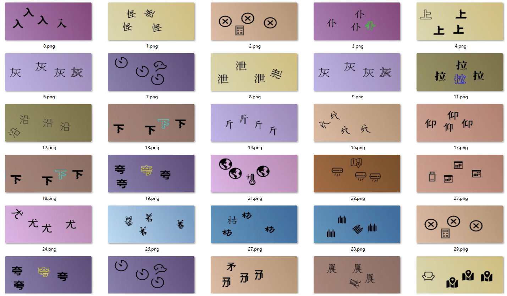

# 声明：本教程只能用于教学目的，如果用于非法目的与本人无关

## 本人24个实战视频教程，后续会更新十几个，每个教程都有配套的数据样本，训练代码，成品模型，推测代码，2k出售，有问题可以随时问，详情联系本人：tomysky67


## 试看视频 顶象空间推理.mkv 链接: https://pan.baidu.com/s/1ly-wmD5GMHpwTb2PpF8-ww?pwd=6666 提取码: 6666


## 视频详解地址：

## 教程素材网址：https://github.com/tomysky/diff_click

## 1.分析



> ​	这个图案中是四个图标或者文字。文字可能的不同有颜色（镂空），角度，字体；图案不同。因为涉及到文字，用图像分类那收集数据，训练数据就太麻烦了。

## 2.解决办法

> 原理：
>
> ​	每个图像的特征向量可以看作是该图像在高维特征空间中的一个点。如果一个图像与其他图像在视觉上有显著的不同，比如背景、颜色、结构等，那么它的特征向量会与其他图像的特征向量在高维空间中距离较远。这种“距离”用余弦相似度衡量时，会表现为较低的相似度。因此，通过这种方法可以找到与其他图像特征差异最大的那个，即“最不同”的图像。
>
> ​	1.先用训练一个yolo模型，找到每个图形或者文字，截取目标图像，防止其他背景干扰
>
> ​	2.使用ResNet50提取图像特征，结合余弦相似度分析，可以有效识别出一组图像中最不同的图像，因为这个图像的特征在高维空间中与其他图像的特征有最大的差异。

## 3.具体代码

```python
#1.get_images.py

import time

from playwright.sync_api import sync_playwright
num = 0
with sync_playwright() as p:
    browser = p.firefox.launch(headless=True)
    page = browser.new_page()
    page.goto('')
    page.locator('xpath=/html/body/div[1]/div[2]/div/div[6]/div/div[2]/div[1]/div/ul/li[11]').click()
    time.sleep(2)
    page.locator('xpath=/html/body/div[1]/div[2]/div/div[6]/div/div[2]/div[2]/div[2]/ul/li[11]/div[2]/div/div[1]/div[3]').click()
    time.sleep(2)
    while True:
        try:
            for i in range(5):
                print("抓取抓取的图片数量：{}".format(str(num)))
                page.locator('xpath=//*[@id="dx_captcha_clickword_hits_4"]').screenshot(path="./images/{}.png".format(str(num)))
                #/html/body/div[11]/div/div[6]/div[2]/span[2]/img
                page.locator('xpath=/html/body/div[11]/div/div[6]/div[2]/span[2]/img').click()
                num += 1
                time.sleep(2)
            time.sleep(2)
            page.reload()
            time.sleep(4)
            page.locator('xpath=/html/body/div[1]/div[2]/div/div[6]/div/div[2]/div[1]/div/ul/li[11]').click()
            time.sleep(2)
            page.locator(
                'xpath=/html/body/div[1]/div[2]/div/div[6]/div/div[2]/div[2]/div[2]/ul/li[11]/div[2]/div/div[1]/div[3]').click()
        except Exception as e:
            print("err:", e)
            print("出错了，重新启动浏览器！")
            time.sleep(5)
            browser.close()
            browser = p.firefox.launch(headless=True)
            page = browser.new_page()
            page.goto('')
            page.locator('xpath=/html/body/div[1]/div[2]/div/div[6]/div/div[2]/div[1]/div/ul/li[11]').click()
            time.sleep(2)
            page.locator(
                'xpath=/html/body/div[1]/div[2]/div/div[6]/div/div[2]/div[2]/div[2]/ul/li[11]/div[2]/div/div[1]/div[3]').click()
            time.sleep(2)
```

```python
# 2.json2txt.py
import json
import os

#输出目录
output_dir = './labels'
#输入目录
input_dir = './labels_json/'

# 标签到类别编号的映射
label_to_id = {
    'target': 0
}

def convert_labelme_to_yolo(json_file_path, output_dir, label_to_id):
    # 打开Labelme的JSON文件
    with open(json_file_path, 'r', encoding='utf-8') as f:
        data = json.load(f)

    # 获取图片的宽度和高度
    image_width = data['imageWidth']
    image_height = data['imageHeight']

    # 获取标注对象
    annotations = data['shapes']

    # 输出TXT文件的路径
    output_file_path = os.path.join(output_dir, os.path.splitext(os.path.basename(json_file_path))[0] + '.txt')

    with open(output_file_path, 'w', encoding='utf-8') as out_file:
        for annotation in annotations:
            label = annotation['label']
            points = annotation['points']

            # 计算标注框的中心点、宽度和高度
            x_min = min([p[0] for p in points])
            x_max = max([p[0] for p in points])
            y_min = min([p[1] for p in points])
            y_max = max([p[1] for p in points])

            x_center = (x_min + x_max) / 2 / image_width
            y_center = (y_min + y_max) / 2 / image_height
            width = (x_max - x_min) / image_width
            height = (y_max - y_min) / image_height

            # 获取类别编号
            class_id = label_to_id.get(label, -1)

            # 检查标签是否在映射中
            if class_id == -1:
                print(f"标签 '{label}' 未在映射中找到。")
                continue

            # 写入YOLO格式
            out_file.write(f"{class_id} {x_center} {y_center} {width} {height}\n")


def create_classes_file(output_dir, label_to_id):
    # classes.txt的路径
    classes_file_path = os.path.join(output_dir, 'classes.txt')

    # 根据label_to_id字典生成classes.txt
    with open(classes_file_path, 'w', encoding='utf-8') as f:
        for label in sorted(label_to_id, key=label_to_id.get):
            f.write(f"{label}\n")


def main():
    files = os.listdir(input_dir)
    for file in files:
        json_file_path = input_dir+file
        print(json_file_path)
        convert_labelme_to_yolo(json_file_path, output_dir, label_to_id)

    create_classes_file(output_dir, label_to_id)

if __name__ == '__main__':
    main()

```

```python
#3.train.py

from ultralytics import YOLO

def train_model():
    # 加载YOLOv8模型
    model = YOLO('./models/yolov8m.pt')  # 你可以选择不同的预训练模型，如'yolov8n.pt', 'yolov8m.pt', 'yolov8l.pt', 'yolov8x.pt'

    # 开始训练
    model.train(
        data='./target.yaml',  # 数据集的配置文件
        epochs=1200,                        # 训练的轮数
        imgsz=640,                         # 输入图像的尺寸
        batch=16,                          # 批处理大小
        device='0',                        # 使用的GPU设备编号
        patience=1200
          )

    # 评估模型
    model.val()

    # 导出模型
    model.export(format='onnx')  # 你可以选择其他格式，如'onnx', 'coreml', 'tflite', 等等

if __name__ == '__main__':
    import multiprocessing
    multiprocessing.freeze_support()  # 确保在Windows系统上正确启动多进程
    train_model()
```

```python
#4.detect_images.py
import os
from PIL import Image
import cv2
import torch
import torch.nn as nn
from torchvision import models, transforms
import numpy as np
from sklearn.metrics.pairwise import cosine_similarity
from ultralytics import YOLO

# 加载预训练的ResNet50模型（去掉最后的全连接层）
resnet_model = models.resnet50(pretrained=True)
resnet_model = nn.Sequential(*list(resnet_model.children())[:-1])  # 去掉最后的全连接层，保留特征提取部分
resnet_model.eval()  # 设定为评估模式，不进行反向传播

# 图像预处理管道：调整大小、中心裁剪、转换为Tensor并标准化
preprocess = transforms.Compose([
    transforms.Resize(256),  # 调整图像大小
    transforms.CenterCrop(224),  # 裁剪图像到224x224的大小
    transforms.ToTensor(),  # 转换为Tensor
    transforms.Normalize(mean=[0.485, 0.456, 0.406], std=[0.229, 0.224, 0.225]),  # 标准化处理
])


def preprocess_image_cv2(img):
    """
    使用OpenCV对图像进行预处理，调整大小和中心裁剪。

    Args:
        img: 输入的OpenCV图像。

    Returns:
        处理后的图像Tensor。
    """
    # 调整图像大小到256x256
    img_resized = cv2.resize(img, (256, 256))
    # 中心裁剪到224x224
    img_cropped = img_resized[16:240, 16:240]

    # 检查图像是否为灰度图像，如果是，则转换为3通道
    if len(img_cropped.shape) == 2:  # 如果是灰度图像（只有height和width两个维度）
        img_cropped = cv2.cvtColor(img_cropped, cv2.COLOR_GRAY2BGR)

    # 将NumPy数组转换为PIL图像
    img_pil = Image.fromarray(cv2.cvtColor(img_cropped, cv2.COLOR_BGR2RGB))

    # 转换为Tensor并进行归一化处理
    img_tensor = preprocess(img_pil)
    img_tensor = img_tensor.unsqueeze(0)  # 添加批次维度
    return img_tensor


def extract_features_cv2(img):
    """
    提取图像的深度特征。

    Args:
        img: 输入的OpenCV图像。

    Returns:
        图像特征的NumPy数组。
    """
    # 预处理图像
    img_tensor = preprocess_image_cv2(img)
    # 提取特征
    with torch.no_grad():  # 关闭梯度计算，加快推理速度
        features = resnet_model(img_tensor)
    # 展平特征向量
    features = features.view(features.size(0), -1)
    return features.numpy()


def calc_diff(imgs):
    """
    计算一组图像之间的余弦相似度，并找出最不同的图像。

    Args:
        imgs: 包含多个OpenCV图像的列表。

    Returns:
        最不同图像的索引。
    """
    # 对每张图像提取特征
    features = [extract_features_cv2(img) for img in imgs]

    # 计算图像之间的余弦相似度矩阵
    similarity_matrix = cosine_similarity(np.array(features).squeeze())

    # 输出相似度矩阵
    # print("Similarity Matrix:\n", similarity_matrix)

    # 寻找相似度最低的图像
    min_similarity = float('inf')  # 初始化最小相似度为无穷大
    diff_image_index = -1  # 初始化最不同图像的索引

    for i in range(len(similarity_matrix)):
        # 计算图像与其他图像之间的平均相似度
        avg_similarity = np.mean([similarity_matrix[i][j] for j in range(len(similarity_matrix)) if i != j])
        # print(f"Image {i} Average Similarity with others: {avg_similarity:.4f}")
        if avg_similarity < min_similarity:  # 如果当前图像的平均相似度更小，则更新
            min_similarity = avg_similarity
            diff_image_index = i

    print(
        f"\nImage {diff_image_index} is the most different from the others with an average similarity of {min_similarity:.4f}.")
    return diff_image_index


def predict_and_draw_boxes(image_path, yolo_model):
    """
    使用YOLO模型预测图像中的目标，找到最不同的目标并绘制其位置。

    Args:
        image_path: 输入图像的路径。
        yolo_model: 预加载的YOLO模型。
    """
    # 读取原始图像
    image_origin = cv2.imread(image_path)
    # 转换为灰度图像
    image = cv2.cvtColor(image_origin, cv2.COLOR_BGR2GRAY)

    # 如果图像是灰度图像，转换为三通道
    if len(image.shape) == 2:  # 只有height和width两个维度
        image = cv2.cvtColor(image, cv2.COLOR_GRAY2BGR)

    # 使用YOLO模型进行预测
    results = yolo_model(image)

    # 解析预测结果
    boxes = results[0].boxes.xyxy  # 获取所有预测框的坐标
    classes = results[0].boxes.cls  # 获取所有预测框的类别
    confidences = results[0].boxes.conf  # 获取所有预测框的置信度
    pos = []  # 存储目标的中心坐标
    imgs = []  # 存储裁剪的目标图像

    for index, box in enumerate(boxes):
        x1, y1, x2, y2 = map(int, box)  # 转换为整数坐标
        class_id = int(classes[index].item())  # 类别ID
        if class_id == 1:  # 如果类别为1，则跳过
            continue

        confidence = confidences[index].item()  # 获取置信度
        if confidence < 0.7:  # 置信度小于0.7则跳过
            continue

        # 计算目标中心点坐标
        centre_x = int((x1 + x2) // 2)
        centre_y = int((y1 + y2) // 2)
        # print("Centre point:", (centre_x, centre_y))
        pos.append((centre_x, centre_y))

        # 裁剪目标区域并保存
        cropped_img = image[y1:y2, x1:x2]
        imgs.append(cropped_img)

    if not imgs:  # 如果没有找到有效图像
        print("No valid images found.")
        return

    # 计算最不同的图像
    res_index = calc_diff(imgs)
    res_pos = pos[res_index]  # 最不同图像的位置
    print("Most different image position:", res_pos)

    # 在原始图像上绘制最不同目标的位置
    cv2.circle(image_origin, res_pos, 10, (0, 255, 0), 2)

    # 显示结果图像
    cv2.imshow('Prediction', image_origin)
    cv2.waitKey(0)
    cv2.destroyAllWindows()


if __name__ == '__main__':
    model_path = 'models/best_s.pt'  # 替换为你的YOLO模型路径
    yolo_model = YOLO(model_path)  # 加载YOLO模型
    base_dir = "./images"  # 输入图像文件夹路径

    # 获取文件夹中所有图像文件并排序
    files = os.listdir(base_dir)
    files.sort(key=lambda x: int(os.path.splitext(x)[0]))  # 按文件名中的数字排序

    # 对每个图像文件进行预测和结果绘制
    for file in files:
        filename = os.path.join(base_dir, file)
        print(filename)
        predict_and_draw_boxes(filename, yolo_model)

```

## 4.商务合作联系tomysky67 老杨
